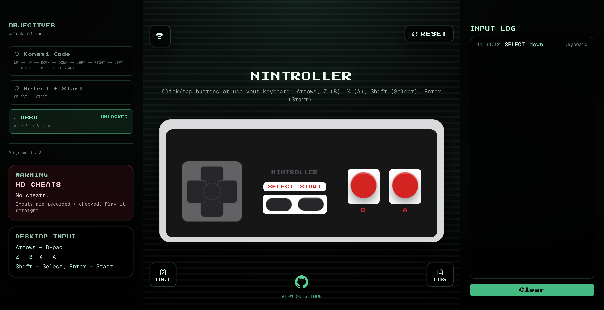

# Nintroller 🎮

A retro-themed Nintendo (NES) controller simulator with real-time input logging and cheat code detection. Built with Next.js, TypeScript, and a terminal/CRT aesthetic.


## Demo

<div align="center">
  
  <p><em>Interactive NES controller with cheat detection and input logging</em></p>
</div>

## Features

- 🎮 **Interactive NES Controller** - Click/tap buttons or use keyboard controls
- 📊 **Real-time Input Logging** - Track all button presses with timestamps and input sources
- 🎯 **Cheat Code Detection** - Automatically detects classic cheat codes (Konami Code, ABBA, etc.)
- 🎨 **Retro Terminal Theme** - CRT scanlines, emerald terminal aesthetic, pixel fonts
- 📱 **Mobile Responsive** - Emulator-style layout on mobile, classic layout on desktop
- 🧪 **TDD Setup** - Full Jest + Testing Library infrastructure with style guards
- ♿ **Accessible** - ARIA labels, keyboard navigation, focus management

## Getting Started

### Prerequisites

- Node.js 20+
- pnpm (recommended) or npm/yarn

### Installation

```bash
# Clone the repository
git clone https://github.com/avicrayyy/nintroller.git
cd nintroller

# Install dependencies
pnpm install

# Run development server
pnpm dev
```

Open [http://localhost:3000](http://localhost:3000) in your browser.

## Usage

### Controller Controls

**Keyboard Mapping**:

- Arrow Keys - D-pad (Up, Down, Left, Right)
- `Z` - B button
- `X` - A button
- `Shift` - Select
- `Enter` - Start

**Mouse/Touch**: Click or tap any button on the controller.

### Cheat Codes

Try entering these sequences:

- **Konami Code**: `↑ ↑ ↓ ↓ ← → ← → B A Start`
- **ABBA**: `A B B A`
- **Select + Start**: `Select Start`

When a cheat is detected, a modal will appear celebrating your discovery! 🎉

### Input Log

- **Desktop**: Input log appears as a fixed right sidebar
- **Mobile**: Tap the "LOG" FAB button in the top-right to open the log drawer

The log shows:

- Timestamp of each event
- Button pressed
- Press state (down/up)
- Input source (keyboard/pointer)

## Development

### Available Scripts

```bash
# Development
pnpm dev          # Start dev server
pnpm build        # Build for production
pnpm start        # Start production server

# Testing
pnpm test         # Run tests once
pnpm test:watch   # Run tests in watch mode
pnpm test:ci      # Run tests in CI mode

# Code Quality
pnpm lint         # Run ESLint
```

### Project Structure

This project follows Next.js 16 App Router conventions with a component-based architecture. Here's a comprehensive overview:

```
nintroller/
├── app/                          # Next.js App Router directory
│   ├── api/                      # API routes
│   │   └── cheats/
│   │       └── route.ts          # Cheat detection endpoint
│   │
│   ├── components/               # React components
│   │   ├── ControllerPlayground/ # Main playground orchestrator
│   │   │   └── index.tsx        # Manages controller, modals, FABs
│   │   │
│   │   ├── NESController/       # NES Controller component
│   │   │   ├── index.tsx        # Re-export shim
│   │   │   ├── NESController.tsx # Main controller UI
│   │   │   ├── BaseButton.tsx   # Reusable button component
│   │   │   └── keyboard.ts      # Keyboard event handlers
│   │   │
│   │   ├── InputLog/            # Input logging system
│   │   │   └── index.tsx        # Component + Context Provider
│   │   │
│   │   ├── InputLogSidebar/     # Right sidebar (desktop) / modal (mobile)
│   │   │   └── index.tsx        # Responsive sidebar component
│   │   │
│   │   ├── ObjectivesSidebar/   # Left sidebar for cheat objectives
│   │   │   └── index.tsx        # Displays cheat list + progress
│   │   │
│   │   ├── ControllerConsoleCards/ # Console-style info cards
│   │   │   └── index.tsx        # Warning & help cards
│   │   │
│   │   └── ui/                  # Reusable UI components
│   │       ├── Button.tsx       # Button component (variants: primary, secondary, emerald)
│   │       ├── IconButton/      # Icon button with FAB variant
│   │       │   └── index.tsx
│   │       └── Modal/           # Accessible modal component
│   │           ├── index.tsx    # Modal wrapper
│   │           └── content/    # Modal content components
│   │               ├── WelcomeContent.tsx
│   │               ├── CheatContent.tsx
│   │               ├── ResetProgressContent.tsx
│   │               └── index.tsx
│   │
│   ├── libs/                     # Business logic libraries
│   │   └── cheats.ts            # Cheat definitions & detection logic
│   │
│   ├── types/                    # TypeScript type definitions
│   │   └── nes-controller.ts    # NES controller types
│   │
│   ├── utils/                    # Utility functions
│   │   └── index.ts             # cx, prettyButtonName, getOrCreateSessionId
│   │
│   ├── globals.css               # Global styles + Tailwind
│   ├── layout.tsx               # Root layout (sidebars, providers)
│   └── page.tsx                 # Home page (renders ControllerPlayground)
│
├── __tests__/                    # Test files
│   ├── components/              # Component tests
│   │   ├── Button.test.tsx
│   │   ├── IconButton.test.tsx
│   │   ├── InputLog.test.tsx
│   │   ├── InputLogSidebar.test.tsx
│   │   ├── ObjectivesSidebar.test.tsx
│   │   ├── ControllerPlayground.test.tsx
│   │   └── CheatModal.test.tsx
│   └── lib/                     # Utility/library tests
│       ├── cheats.test.ts
│       ├── keyboard.test.ts
│       └── utils.test.ts
│
├── public/                       # Static assets
│   └── demo-vid.mp4             # Demo video
│
└── [config files]               # package.json, tsconfig.json, etc.
```

#### Key Directories Explained

- **`app/components/`**: All React components organized by feature

  - Each component lives in its own folder with an `index.tsx` entry point
  - `ui/` contains reusable components used across the app
  - Feature components (like `NESController/`, `InputLog/`) are self-contained

- **`app/libs/`**: Pure business logic (no React dependencies)

  - Cheat detection algorithms
  - Data transformations
  - Utility functions that don't depend on React

- **`app/types/`**: Shared TypeScript type definitions

  - Centralized types for better maintainability
  - Used across components and utilities

- **`app/utils/`**: Shared utility functions

  - `cx()` for className concatenation
  - Formatting helpers
  - Client-side utilities (localStorage, etc.)

- **`__tests__/`**: Test organization mirrors source structure
  - `components/` for React component tests
  - `lib/` for utility/library tests
  - Follows TDD principles with comprehensive coverage

#### Component Architecture Patterns

1. **Folder-based organization**: Each component has its own folder
2. **Re-export shims**: `index.tsx` files provide clean import paths
3. **Context providers**: Shared state via React Context (e.g., `InputLogProvider`)
4. **Event-driven communication**: Custom events for cross-component updates
5. **Responsive design**: Mobile-first with desktop enhancements

### Code Style

This project enforces:

- **No `React.*` namespace usage** - Use direct imports (`useState`, `useEffect`, etc.)
- **Component folder structure** - Components live at folder entrypoints
- **TypeScript strict mode** - Full type safety
- **TDD approach** - Tests written alongside features

See `SESSION_NOTES.mdx` for detailed development notes and architecture decisions.

## Tech Stack

- **Framework**: [Next.js 16](https://nextjs.org/) (App Router)
- **Language**: TypeScript
- **Styling**: Tailwind CSS 4
- **Testing**: Jest + Testing Library
- **Fonts**: Press Start 2P (Google Fonts)

## Contributing

1. Fork the repository
2. Create a feature branch (`git checkout -b feature/amazing-feature`)
3. Write tests for your changes
4. Ensure all tests pass (`pnpm test`)
5. Ensure linting passes (`pnpm lint`)
6. Commit your changes (`git commit -m 'Add amazing feature'`)
7. Push to the branch (`git push origin feature/amazing-feature`)
8. Open a Pull Request

## License

This project is private and not licensed for public use.

## Acknowledgments

- Inspired by classic NES controllers and retro gaming aesthetics
- Built with modern web technologies for a nostalgic experience

---

Made with ❤️ and lots of button presses
